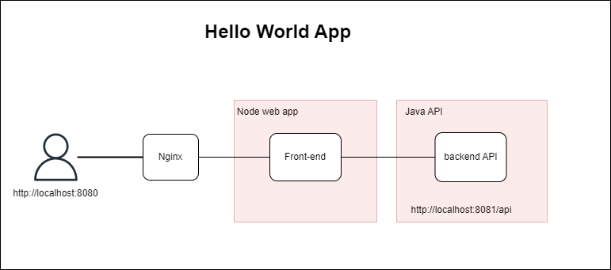

# Hello World APP 

Este proyecto es parte de una prueba tecnica para la posicion Devops Engineer. La prueba consta de 4 partes Donde se evaluan habilidades en las siguientes areas: 

- Configuration management - Ansible 
- CI/CD 
- Documentacion 
- Automatizacion de tareas  

## Descripcion de la  aplicacion  

La aplicacion web consta de dos partes:  

- Frontend:  react, vite, nodejs. 

- Backend: desarollado en Java utilizando el framework spring boot, expone una api REST (/api) que retorna un saludo de bienbenida indicando el stage o de la aplicacion o perfil de en spring boot.

## En que consiste la prueba

La prueba consta de los siguiente 4 Desafios

## 1. Crear un playbook en Ansible que configure los siguientes puntos en un servidor Oracle Linux v8:  

El archivo configuration.yaml describe un ansible playbook que apovisiona un host con Oracle Linux con los siguiente servicios: 

- docker.
- Docker compose.
- Chrony y que apunte a un servidor diferente al que viene por defecto.
- Ping, netstat y wget. 
- Agregar un usuario y darle permisos de sudo.
- Firewall activo y permitir el acceso por los puertos 8080, 8081 y 443.

## 2. Crear un pipeline en Jenkins para desplegar tanto el frontend como el backend de la aplicación provista en un ambiente contenerizado 

### Frontend  

### Backend  

## 3. Proveer un diagrama donde se refleje la arquitectura de la aplicación desplegada  

## 4. Crear script de automatizacion 

El script ubicado en la ruta `scripts/invoice.sh` comprime todos los archivos del presente mes y elimina los archivos originales. 

